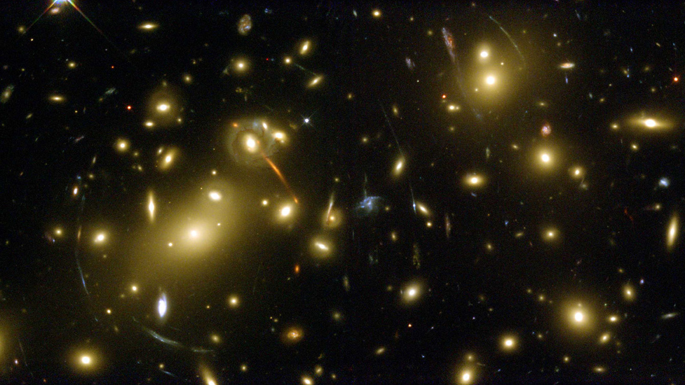

I am a graduate student studying physics and astronomy at the University of California, Santa Cruz under my advisor [Tesla Jeltema](http://scipp.ucsc.edu/~tesla/). My main interests are in observational cosmology - the study of the structure, evolution, and origin of the universe by sticking a big camera on an even larger telescope and looking up!

I am a member of the [Dark Energy Survey](https://www.darkenergysurvey.org/) (DES), an international collaboration of hundreds of scientists investigating the dynamics and large-scale structure of the universe using multiple observationalprobes. We do this by taking hundreds of thousands of images of the Southern sky at the 4-meter Victor Blanco Telescope at [Cerro Tololo Inter-American Observatory (CTIO)](http://www.ctio.noao.edu/noao/) in central Chile. Check out our newest [publications here](https://www.darkenergysurvey.org/news-and-results/publications/)!

I spend most of my time building statistical models and running large simulations to understand how subtle systematics affect our cosmological results. Check out my work on [Balrog](https://github.com/sweverett/Balrog-GalSim), an image simulation tool that characterizes measurement biases by injecting an ensemble of fake objects into real images. Lately I've been working on a new DES [clusters cosmology pipeline](https://bitbucket.org/mpaterno/y3_cluster_cpp/) that quickly evalutates millions of high-dimensional integration samples using [CosmoSIS](https://bitbucket.org/joezuntz/cosmosis/wiki/Home). Or take a look at my [github account](https://github.com/sweverett) for all my latest projects!

I am also a committee representative for Early Career Scientists (ECS), a group of students, postdocs, and research fellows within DES. We provide a space where the career interests and concerns of younger scientists are discussed and regularly meet with DES leadership express ECS concerns. We also plan ECS-related activities at collaboration meetings including career panels, application and professional skill workshops, and biannual ECS drinks!

I have been lucky to have had many supportive mentors along my (still early!) scientific career, particularly [Tesla Jeltema](https://scipp.ucsc.edu/~tesla/) at UCSC, [Phil Marshall](http://www.slac.stanford.edu/~pjm/Site/Welcome.html) at SLAC National Laboratory, and [Jesus Pando](https://csh.depaul.edu/faculty-staff/faculty-a-z/Pages/physics/jesus-pando.aspx) at DePaul University.

For more info
------
More info about configuring academicpages can be found in [the guide](https://academicpages.github.io/markdown/). The [guides for the Minimal Mistakes theme](https://mmistakes.github.io/minimal-mistakes/docs/configuration/) (which this theme was forked from) might also be helpful.
